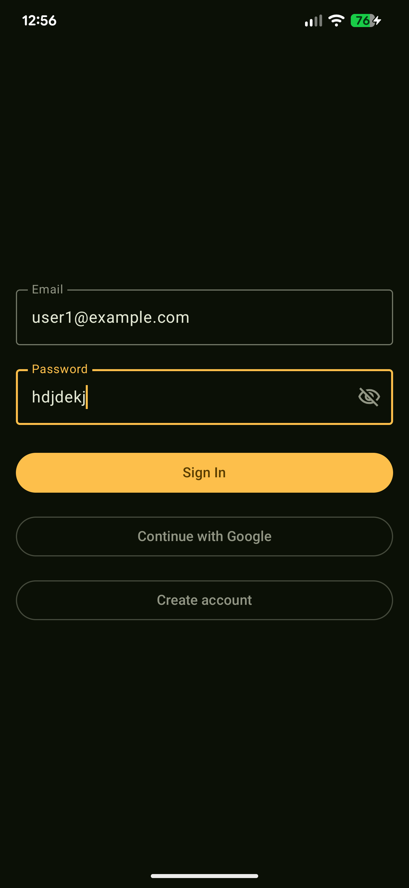
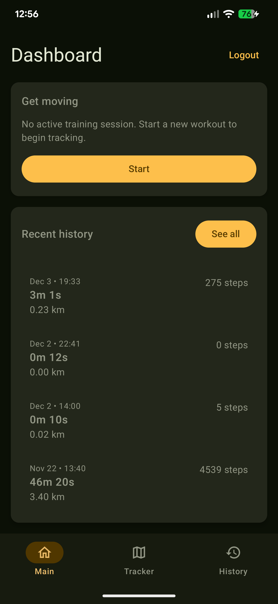
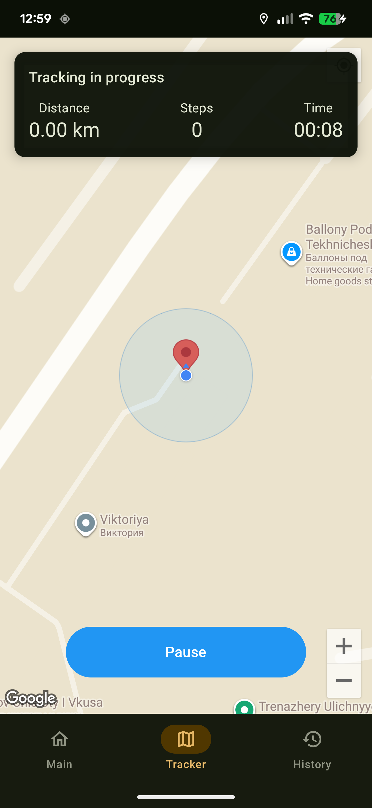
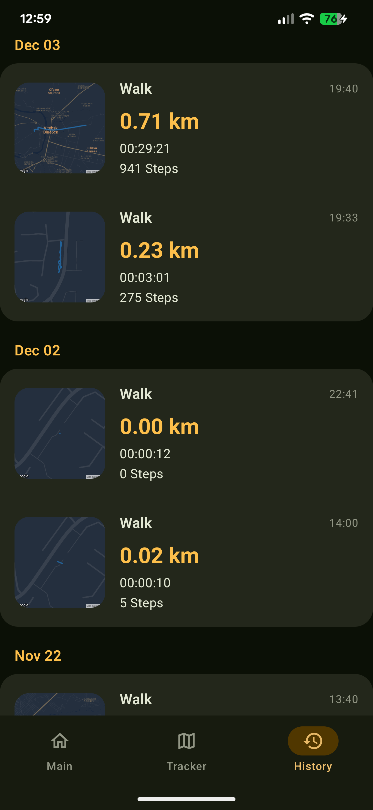
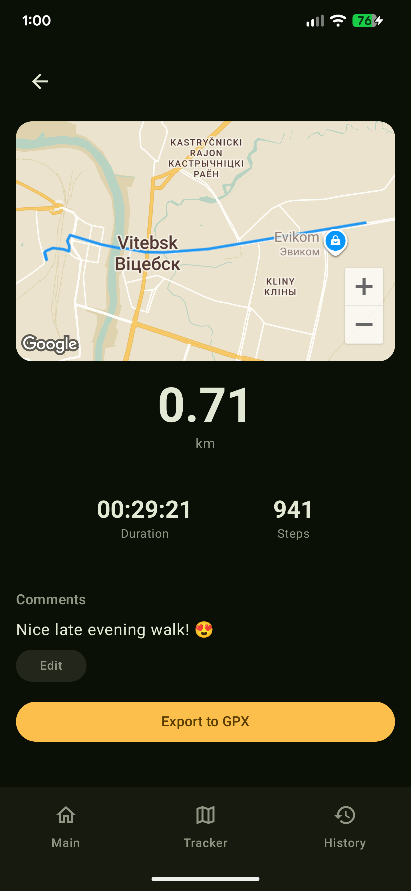
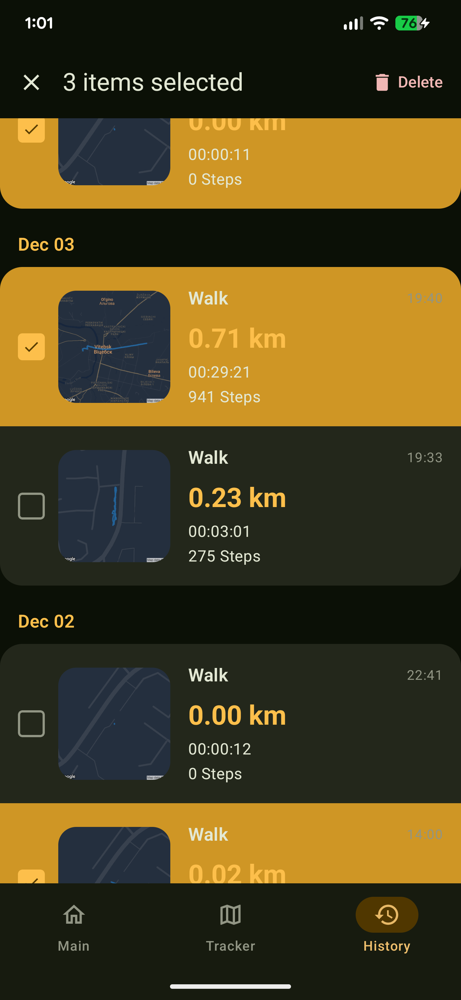

### 🗺️ Project: GPS Tracker – Activity Tracking & Route History

---

### 📝 1. Description

**GPS Tracker** is an Android app that lets users track walking/running sessions with GPS in real time, see live stats (distance, steps, time), and review their workout history with route maps and detailed stats.  
Sessions are synced to Firebase, so history is preserved across devices once the user signs in.

---

### ✨ 2. Main Features

- **👤 User Authentication**
    -  Email/password sign up & login
    -  Google Sign-In integration

- **📍 Live Activity Tracking**
    -  Foreground service that records location route points while tracking
    -  Real-time stats
    -  Full-screen Google Map

- **📚 History Screen**
    -  Grouped list of completed sessions by date
    -  Multi-select mode with possibility to delete passed routes
    -  Map showing the recorded route and detailed stats on HistoryDetails screen

- 📤 **Export to GPX**
    -  Exports the session route as a `.gpx` file to the Downloads folder via `MediaStore`

- **🔥 Firebase Auth & Firestore backend**

---

### 📸 3. Screenshots

- **Login Screen**
- **Dashboard**
- **Tracker (Live map)**
- **History List**
- **History Detail (Route + stats + comments)**
- **Selection Mode & Delete**

```markdown






```

---

### 🏗️ 4. Project Structure & Architecture

The project follows a layered, clean architecture with `data`, `domain`, and `presentation` layers: repositories and data sources (Firestore, Firebase Auth, location/time utilities) live in `data`, pure business models and use cases in `domain`, and all Jetpack Compose UI, navigation, and ViewModels in `presentation`. Dependency injection is handled via Hilt modules, while navigation is centralized in a single `NavHost` with feature-based screen packages (`dashboard`, `tracker`, `history`, `login`) and shared UI components like `RouteMap` and permission dialogs.

| Layer | Components                                                                                                                                            |
|-------|-------------------------------------------------------------------------------------------------------------------------------------------------------|
| **🎨 Presentation Layer** | • Jetpack Compose UI Screens<br>• ViewModels (MVVM Pattern)<br>• Compose Navigation with NavigationManager<br>• UI Components (RouteMap, Dialogs, Cards) |
| **🎯 Domain Layer** | • Use Cases (Start/Stop/Pause/Resume Tracking)<br>• Domain Models (ActivitySession, Stats, User)<br>• Repository Interfaces (ActivitySession, Auth)   |
| **💾 Data Layer** | • Repository Implementations (Firestore, Auth)<br>• Firestore Data Sources<br>• Tracking Services (Location, Time, Distance)<br>• GpxExporter Utility<br>• Foreground Service for Continuous Tracking |

---

### 🛠️ 5. Technologies Used

- **💻 Language & Runtime**
    - Kotlin
    - Coroutines & Flow

- **🎨 UI**
    - Jetpack Compose
    - Material 3
    - Compose Navigation
    - Coil (for image & static map thumbnails)

- **🗺️ Maps & Location**
    - Google Maps SDK for Android
    - Maps Compose
    - Google Play Services Location
    - Google Maps Android Utils (polyline & map utilities)
    - Static Maps API (for History thumbnails)

- **🔥 Firebase**
    - Firebase Authentication
    - Cloud Firestore

- **🏗️ DI**
    - Hilt

- **🧪 Testing**
    - JUnit
    - Coroutines Test
    - Turbine (Flow testing)

---

### 📥 6. Installation & Setup

#### Prerequisites

- Android Studio (Giraffe / Jellyfish or newer)
- Android SDK 24+ (minSdk 24, targetSdk 36)
- A Firebase project configured for:
    - Firebase Authentication
    - Cloud Firestore
- Google Cloud project with:
    - Maps SDK for Android enabled
    - Static Maps API enabled
- A valid **`google-services.json`** for your Firebase project (placed under `app/`)

#### 1. Clone the repo

```bash
git clone https://github.com/VolleyLord/physical-activity-tracking-app
cd gps_tracker
```

#### 2. Set up `google-services.json`

- In Firebase console, add an Android app with your application ID:  
  `com.volleylord.gps_tracker`
- Add the following rules:
 ```bash
   rules_version = '2';
   service cloud.firestore {
     match /databases/{database}/documents {
       match /activity_sessions/{sessionId} {
         // Users can only read/write their own sessions
         allow read, write: if request.auth != null && 
           request.auth.uid == resource.data.user_id;
         // Users can create sessions with their own user_id
         allow create: if request.auth != null && 
           request.auth.uid == request.resource.data.user_id;
       }
     }
   }
 ```
- Add an index:  
  Collection ID: `activity_sessions` <br>
  Fields: `user_id` (asc) , `status` (asc) , `started_at_epoch_millis` (desc) <br>
  Query scope: `Collection`
- Enable `Google` and `Email/Password` sign-in methods
- Download `google-services.json` <br>
  *Make sure it has client with type `3` inside the configuration file*
- Place it under: `app/google-services.json`

#### 3. Configure API keys & map IDs in `local.properties`

Open (or create) `local.properties` (already exists, but you add keys there, do **not** commit it):

```properties
sdk.dir=...               # already there from Android Studio

MAPS_API_KEY=YOUR_STATIC_AND_DYNAMIC_API_KEY
STATIC_MAP_ID=YOUR_STATIC_MAP_STYLE_ID     # for static thumbnails in History
MAPS_MAP_ID=YOUR_DYNAMIC_MAP_STYLE_ID      # for RouteMap / GoogleMap styling
```

- `MAPS_API_KEY`:
    - Should be a Google API key with:
        - **Maps SDK for Android** enabled (for dynamic map)
        - **Static Maps API** enabled (for History thumbnails)
    - Restrict the key to your specific android app

- `STATIC_MAP_ID`:
    - Optional custom style ID for Static Maps; can be empty if you don't use custom map styles

- `MAPS_MAP_ID`:
    - Optional custom map style ID for the dynamic map (Maps SDK); can be empty if you use default styling

You can get Map ID after styling your map here: https://mapstyle.withgoogle.com/ . Click Finish -> Copy JSON file -> Go to Google Cloud console -> click `Create Style` -> Paste your JSON -> follow the instructions to get map id.


#### 4. Sync & build

- Open the project in Android Studio
- Gradle sync should run automatically; if not, trigger:  
  **File → Sync Project with Gradle Files**

#### 5. Run the app

- Connect an Android device or start an emulator (API 24+)
- Run the `app` configuration from Android Studio
- Sign up or sign in
- Grant location, activity recognition, and notification permissions when prompted

